## MAP FILE EXTENSION

to use the map file extension basically it needs to have 
a 50x50 grid where each char is seperated by a space.

# Lookup Grid

a => 

b => 

c => 

d => 

e => 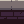

f => 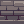

g => 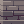

h => 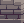

i => 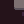

j => 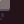

k => 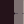

l => 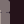

m => 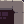

n => 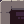

o => 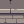

p => 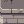

q => 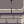

r => 

# Rendering

It is rendered from the bottom left coordinate and is 50x50 pixels